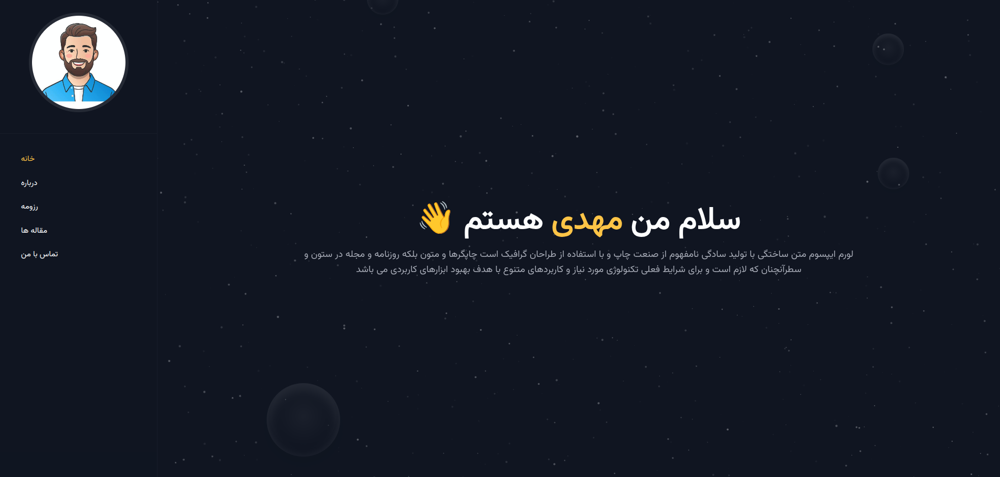
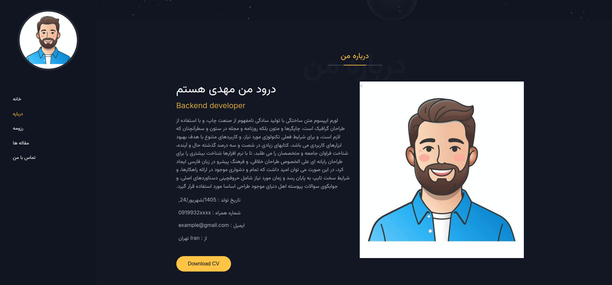

# Personal Website

A personal website built with Django to present personal information, skills, services, resume, blog posts, and contact information.

<p align="center">
  <a href="https://www.python.org/">
    
  </a>
  <a href="https://www.djangoproject.com/">
    
  </a>
  <a href="https://www.mysql.com/">
    
  </a>
  <a href="https://docs.astral.sh/uv/">
    
  </a>
  <a href="https://github.com/unfoldadmin/django-unfold">
    
  </a>
</p>

<p align="center">
  <a href="https://pypi.org/project/django-cleanup/">
    
  </a>
  <a href="https://pypi.org/project/django-social-share/">
    
  </a>
  <a href="https://pypi.org/project/django-unfold-rtl/">
    
  </a>
  <a href="LICENSE">
    
  </a>
</p>

---

## 📸 Preview

### Home Page

<p align="center">
  
</p>

### About Page

<p align="center">
  
</p>

---

## ✨ Features

- Personal profile and information
- Skills and services management
- Resume management
- Blog and article management
- Contact information management
- Social media management
- Customized Django Admin panel
- Modern Admin interface with Django Unfold
- RTL support for the Admin panel
- Jalali date support
- Automatic cleanup of uploaded files
- Social sharing functionality
- Environment-based configuration for sensitive settings

---

## 🛠️ Technologies

- Python
- Django
- MySQL
- Django Unfold
- django-unfold-rtl
- django-cleanup
- django-social-share
- python-dotenv
- jdatetime
- uv

---

## 🚀 Installation

### 1. Clone the repository

```bash
git clone https://github.com/MMahdiGhaioumi/personal_website.git
cd personal_website
```

### 2. Install the project dependencies

The project provides both `pyproject.toml` and `requirements.txt`, so you can choose the installation method that fits your workflow.

#### Using `requirements.txt`

```bash
pip install -r requirements.txt
```

#### Using `uv`

If you use [uv](https://docs.astral.sh/uv/), you can install and synchronize the project's dependencies with:

```bash
uv sync
```

The project also includes `pyproject.toml`, which contains the project's package and dependency configuration.

---

### 3. Install MySQL

Install **MySQL Server** on your system and make sure that the MySQL service is running.

Then create a database for the project:

```sql
CREATE DATABASE personal_website;
```

You can use a different database name if you prefer.

---

### 4. Configure environment variables

Copy `.env.example` to `.env`:

```bash
cp .env.example .env
```

Then open `.env` and enter your MySQL connection information:

```env
DB_NAME=personal_website
DB_HOST=localhost
DB_PORT=3306
DB_USER=your_username
DB_PASSWORD=your_password
```

Replace these values with your own MySQL configuration.

> **Important:** Never commit your `.env` file to Git or GitHub. It contains private configuration and credentials.

---

### 5. Generate a Django Secret Key

Generate a new Django secret key from the shell:

```bash
python -c "from django.core.management.utils import get_random_secret_key; print(get_random_secret_key())"
```

Copy the generated value into `.env`:

```env
SECRET_KEY=your_generated_secret_key
```

Keep your secret key private and never publish it in the repository.

---

### 6. Apply migrations

```bash
python manage.py migrate
```

---

### 7. Create a superuser

```bash
python manage.py createsuperuser
```

---

### 8. Run the development server

```bash
python manage.py runserver
```

Then open:

```text
http://127.0.0.1:8000/
```

The Django Admin panel is available at:

```text
http://127.0.0.1:8000/admin/
```

---

## ⚙️ Environment Variables

The project uses environment variables for sensitive configuration.

The main variables include:

```env
SECRET_KEY=
DB_NAME=
DB_HOST=
DB_PORT=
DB_USER=
DB_PASSWORD=
```

Use `.env.example` as a template for creating your local `.env` file.

---

## 📁 Project Structure

Some of the important project files are:

```text
personal_website/
│
├── .env.example
├── .gitignore
├── LICENSE
├── manage.py
├── pyproject.toml
├── requirements.txt
├── README.md
│
├── docs/
│   └── images/
│       ├── home-preview.png
│       └── about-preview.png
│
└── ...
```

---

## 🎨 Django Admin

The project uses [Django Unfold](https://github.com/unfoldadmin/django-unfold) to provide a modern Django Admin interface.

[django-unfold-rtl](https://pypi.org/project/django-unfold-rtl/) is used to provide RTL support for the Admin interface.

The Admin panel has been customized through Django's Admin API and project-specific admin configurations.

---

## 🧹 File Cleanup

The project uses [django-cleanup](https://pypi.org/project/django-cleanup/) to automatically clean up files associated with `FileField` and `ImageField`.

---

## 🔗 Social Sharing

The project uses [django-social-share](https://pypi.org/project/django-social-share/) to provide social sharing functionality for website content.

---

## 📚 Resources

- [Django Documentation](https://docs.djangoproject.com/)
- [Python Documentation](https://docs.python.org/)
- [MySQL Documentation](https://dev.mysql.com/doc/)
- [uv Documentation](https://docs.astral.sh/uv/)
- [Django Unfold](https://github.com/unfoldadmin/django-unfold)
- [django-unfold-rtl](https://pypi.org/project/django-unfold-rtl/)
- [django-cleanup](https://pypi.org/project/django-cleanup/)
- [django-social-share](https://pypi.org/project/django-social-share/)
- [python-dotenv](https://pypi.org/project/python-dotenv/)
- [jdatetime](https://pypi.org/project/jdatetime/)

---

## 📄 License

This project is licensed under the **LGPL-2.1** license.

See the [`LICENSE`](LICENSE) file for more information.

---

Made with ❤️ by **Mohammad Mahdi Ghaioumi**
